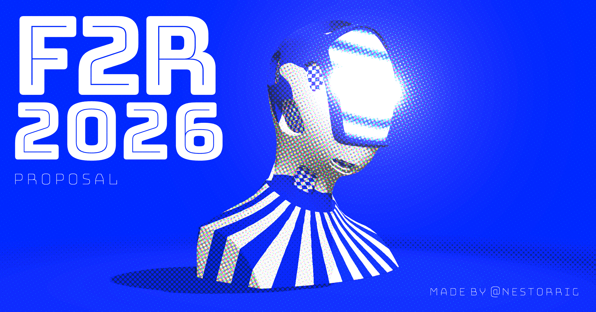

# Fiction 2 Reality 2026



Interactive 3D proposal for [Fiction 2 Reality](https://f2r.by-fiction.com/) 2026, by [@nestorrig](https://github.com/nestorrig).

**Live site:** [nestorrig.github.io/F2R-2026](https://nestorrig.github.io/F2R-2026/)

## About

A Cinema 4D bust running in the browser: striped body, noisy head, checker patches and a CRT-style visor, all built with TSL node materials. The frame goes through bloom and a CMYK-style halftone pass.

On desktop the camera eases around the model with the pointer. On mobile it uses orbit controls, pulled back so the sculpture stays readable.

## Stack

- **Cinema 4D** — model (`assets/modelo.glb`)
- **Three.js r185** — `WebGPURenderer`, with a WebGL2 fallback
- **TSL** — materials and the postprocessing graph
- **Bloom + halftone** — print-like finish over the emissive visor

## Local

Serve the folder over HTTP (ES modules). Any static server works:

```bash
npx serve .
```

Then open the URL it prints. Add `#debug` to the address bar to open the Three.js Inspector (colors, lights, bloom, halftone).

## License

[MIT](./LICENSE) © 2026 Nestor Rios.
